# Jellyfin on a VPS: a secure family media server

> A practical, **provider-neutral** recipe for running your own [Jellyfin](https://jellyfin.org) server on a rented Linux VPS:
> HTTPS, a locked-down firewall, key-only SSH, automatic updates and backups, tuned for **Direct Play** on
> **LG webOS TVs, phones and browsers**. No subscriptions, no cloud lock-in.


**Who is this for?** Families and friends who want a private Netflix-style library on a small budget, without running a server at home.
**What do you need?** A KVM VPS with Ubuntu 24.04 and a big data disk, a hostname, and about 1–2 hours.

---

## Contents

1. [What you get](#what-you-get)
2. [Screenshots](#screenshots)
3. [Architecture](#architecture)
4. [Two ways to follow along](#two-ways-to-follow-along)
5. [Install flow](#install-flow)
6. [Requirements](#requirements)
7. [Quick start (manual)](#quick-start-manual)
8. [How much can a small VPS stream?](#how-much-can-a-small-vps-stream)
9. [Direct Play: the one idea that matters](#direct-play-the-one-idea-that-matters)
10. [Security model](#security-model)
11. [Storage layout](#storage-layout)
12. [Repository layout](#repository-layout)
13. [Scripts](#scripts)
14. [Day-2 operations cheat sheet](#day-2-operations-cheat-sheet)
15. [FAQ](#faq)
16. [Honest limitations](#honest-limitations)
17. [Project status](#project-status)
18. [Contributing and license](#contributing-and-license)

---

## What you get

| | |
|---|---|
| **Platform** | Ubuntu 24.04 LTS, Docker Engine and Compose plugin (official repository) |
| **Media server** | Jellyfin in a hardened container: pinned version, health check, memory limit, log rotation, read-only media |
| **HTTPS** | Caddy reverse proxy with automatic Let's Encrypt certificates and renewal |
| **Access control** | Key-only SSH, no root login, UFW firewall, fail2ban, separate admin and family accounts |
| **Operations** | Unattended security updates, weekly config backups, disk-full alerts, `verify.sh` health check |
| **Guidance** | Capacity maths, codec compatibility for TVs/browsers/phones, library preparation, troubleshooting |
| **Tooling** | An offline browser **wizard** that builds your commands and tracks progress |

## Screenshots

What the optional [theme](docs/12-theme.md) looks like (a "Netflix-style" skin; it changes only looks, never what the server does). The home page has a rotating billboard and rows; hovering a poster shows quick actions; a click opens an info panel with a muted preview; the movie page keeps the same look; category pages get their own billboard; phones get the compact layout.

| | |
|---|---|
| 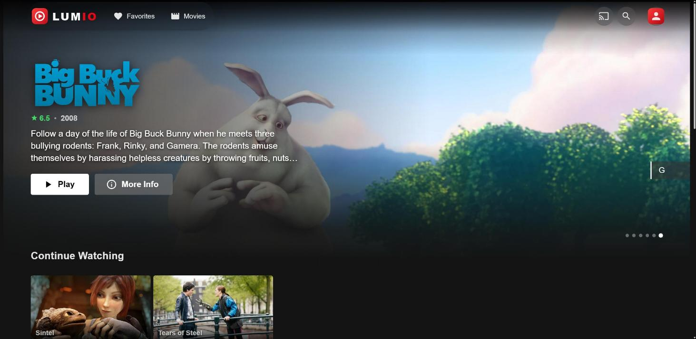 **Home: billboard** | 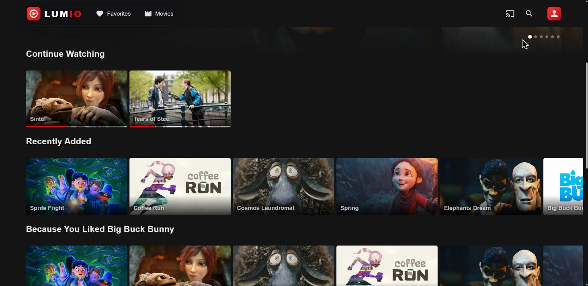 **Home: rows (Continue Watching, Recently Added, ...)** |
| 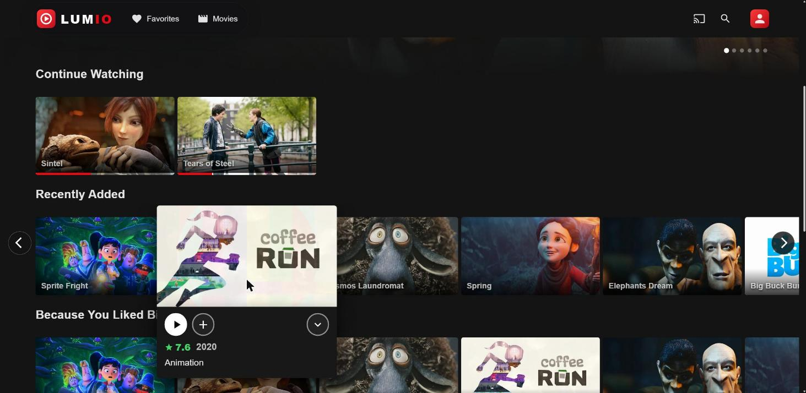 **Hover: Play, + My list, More info** | 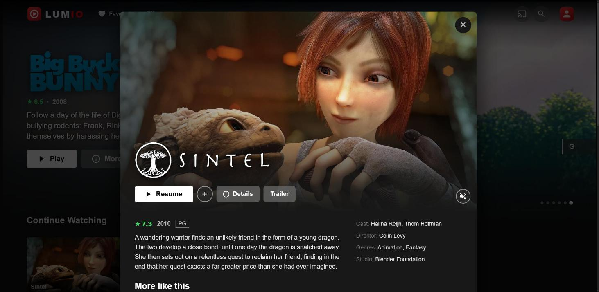 **Click: info panel with preview, Details, Trailer** |
| 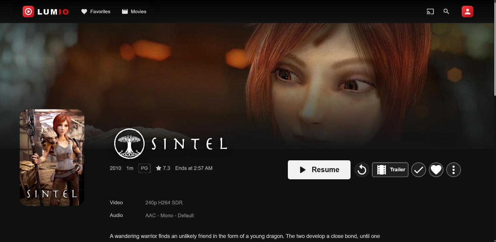 **Movie page** | 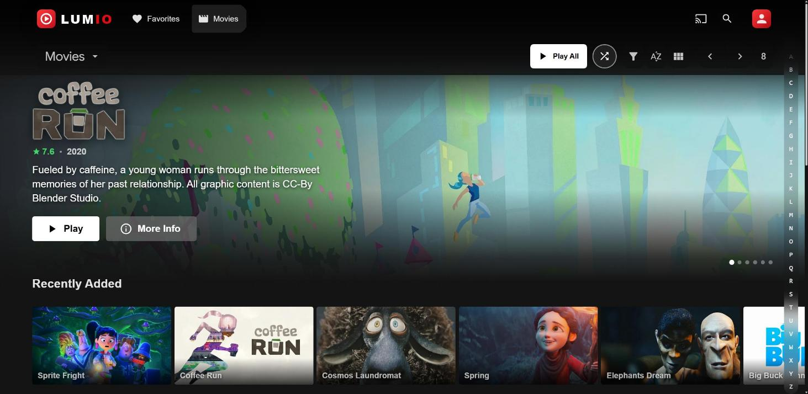 **Category page: billboard, rows, full list** |
| 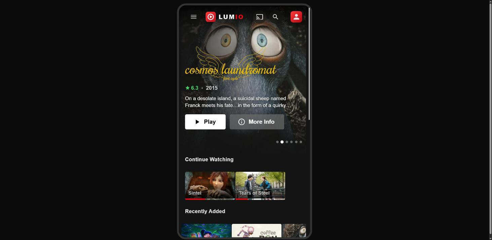 **Phone** | 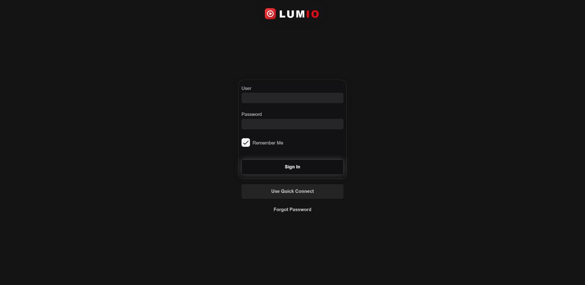 **Login** |

The screenshots were made on a throw-away demo server that contained only openly licensed films from the Blender Foundation (Sintel, Tears of Steel, Big Buck Bunny, Elephants Dream, Spring, Cosmos Laundromat, Coffee Run, Sprite Fright; Creative Commons CC BY, artwork via TMDb). The demo files were tiny placeholders, so nothing here shows real playback quality. The demo has since been deleted. The name "Lumio" is just an example: the server name and brand text are yours to change.

## Architecture

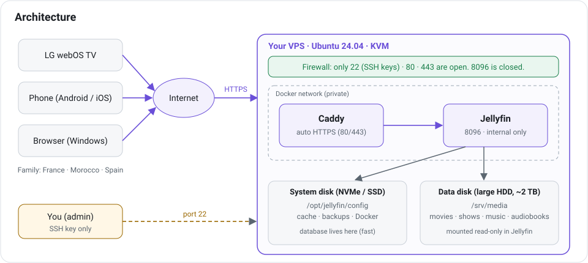

Only ports **22** (SSH, key only), **80** and **443** are open. Jellyfin listens on **8096 inside a private Docker network**; nothing
from the internet can reach it except through Caddy. The Jellyfin database lives on the small fast system disk, the media on the big disk.

## Two ways to follow along

### A. The local wizard (recommended)

Open [`wizard/index.html`](wizard/index.html) in any browser. No server, no internet, no install.

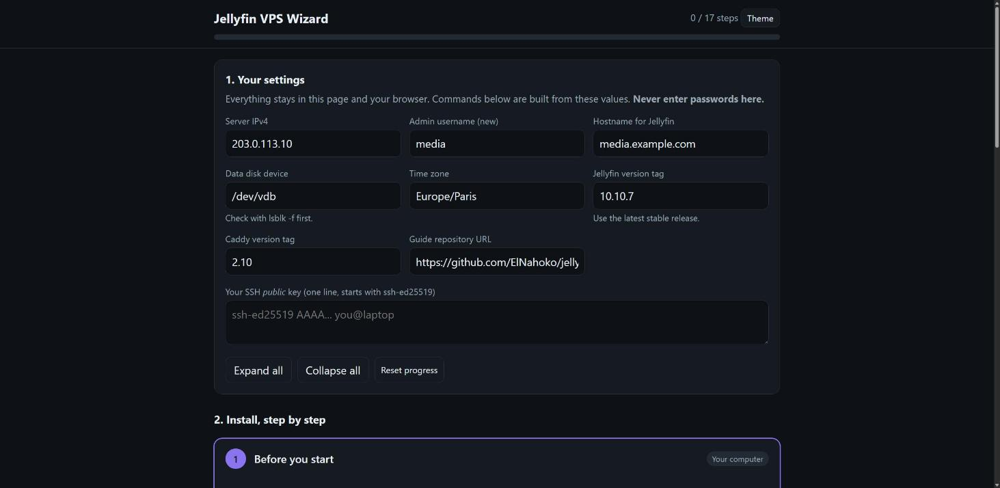

- Enter your **IP, hostname, admin username and SSH public key** once; every command is generated for you with a **Copy** button.
- 17 steps, each labelled **On your computer** or **On the server**, with expected results and a "Mark done" box.
- The next unfinished step opens automatically; a progress bar shows where you are. Progress is stored **only in your browser**.
- Paste the output of `verify.sh` and it tells you what passed and what failed.
- It **never asks for a password** and sends nothing anywhere. Values are validated before they go into a command.

### B. The written guides

Read [`docs/`](docs) in order. Each page explains *why* before *how*:

| # | Guide | What |
|---|---|---|
| 1 | [Choosing a VPS](docs/01-choosing-a-vps.md) | What to verify before you pay, capacity math |
| 2 | [Secure the server](docs/02-secure-the-server.md) | Admin user, SSH keys, firewall, updates |
| 3 | [Storage](docs/03-storage.md) | Identify, mount and lay out the big disk without losing data |
| 4 | [Docker and Jellyfin](docs/04-docker-and-jellyfin.md) | Install, configure, private first-run wizard |
| 5 | [HTTPS and DNS](docs/05-https-and-dns.md) | Hostname, Caddy, reverse-proxy settings |
| 6 | [Configure Jellyfin](docs/06-configure-jellyfin.md) | Libraries, users, Direct Play, client compatibility |
| 7 | [Backups and maintenance](docs/07-backups-and-maintenance.md) | Backup, update, monitoring, recovery, cancelling |
| 8 | [Add media and test](docs/08-first-media-and-testing.md) | Legal sample media, playback checks, four-stream test |
| 9 | [Connect devices](docs/09-clients.md) | LG TV, phones, browsers, inviting family |
| 10 | [Troubleshooting](docs/10-troubleshooting.md) | Symptom → cause → fix |
| 11 | [Upload page](docs/11-upload-page.md) | Optional: drag-and-drop uploads from a browser |
| 12 | [Theme](docs/12-theme.md) | Optional: nicer look, colourful library tiles |

## Install flow

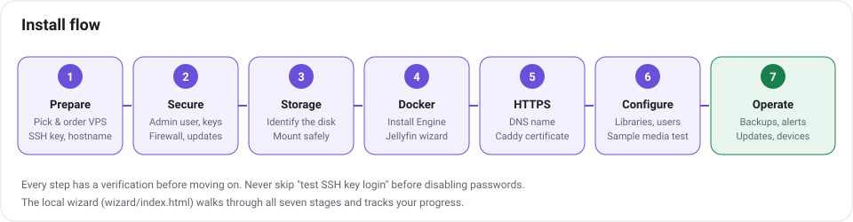

Every stage ends with a check you can see passing. The most important one: **prove SSH key login works in a second terminal
before you disable passwords**, and keep your provider's recovery console in reach.

## Requirements

| Need | Details |
|---|---|
| **Server** | KVM (or other full virtualization) VPS, root access, Ubuntu 24.04 template, public IPv4. Container-style VPS (OpenVZ/LXC) often cannot run Docker properly. |
| **CPU / RAM** | 1–2 vCPU and 2 GB RAM are enough for **Direct Play** with 3–4 viewers. Not enough for 4 simultaneous video transcodes. |
| **Disks** | A small fast system disk (SSD/NVMe) for OS, Docker and the Jellyfin database; a large data disk for media. |
| **Traffic** | See the [capacity table](#how-much-can-a-small-vps-stream). Check your plan's monthly allowance and port speed. |
| **Hostname** | A name pointing at the server (your own domain, or a free dynamic-DNS name). TV apps need a publicly trusted certificate. |
| **Your computer** | An SSH client (`ssh`, `ssh-keygen`, `rsync`): built into Linux, macOS and Windows 10/11. |
| **Legal** | Only host media you have the right to share. Check your provider's terms allow personal media streaming and its CPU/IO fair-use rules. |

## Quick start (manual)

Prefer the terminal? On a fresh Ubuntu 24.04 server:

```bash
# 1) as root: get the guide, create an admin user, firewall, updates (does NOT disable passwords yet)
apt-get update && apt-get install -y git
git clone https://github.com/ElNahoko/selfhost-jellyfin.git && cd selfhost-jellyfin
ADMIN_USER=media PUBKEY_FILE=/root/mykey.pub bash scripts/01-bootstrap.sh

# 2) in ANOTHER terminal: prove key login works
ssh media@SERVER_IP

# 3) as media: lock SSH, install Docker, mount the data disk (look with `lsblk -f` first!)
sudo ADMIN_USER=media bash scripts/02-lock-ssh.sh
sudo bash scripts/03-install-docker.sh
sudo bash scripts/04-mount-media.sh /dev/vdb            # add --format ONLY for an empty disk

# 4) deploy the stack
sudo mkdir -p /opt/jellyfin/{config,cache,backups,scripts}
sudo cp deploy/compose.yaml deploy/compose.setup.yaml deploy/Caddyfile /opt/jellyfin/
sudo cp deploy/.env.example /opt/jellyfin/.env && sudo nano /opt/jellyfin/.env
sudo cp scripts/*.sh /opt/jellyfin/scripts/ && sudo chown -R media:media /opt/jellyfin /srv/media
```

Then do the Jellyfin first-run setup **privately** through an SSH tunnel, point DNS at the server, and start the real stack
(`docker compose up -d`). The exact commands, with explanations, are in [Docker and Jellyfin](docs/04-docker-and-jellyfin.md)
and [HTTPS and DNS](docs/05-https-and-dns.md), or simply follow the [wizard](#a-the-local-wizard-recommended).

## How much can a small VPS stream?

With **Direct Play** the server just reads a file and sends it: network and disk matter, CPU barely does.

| Viewers | Typical 1080p file | Sustained upload needed | Traffic if watching 3 h/day for 30 days |
|---|---|---|---|
| 1 | 10 Mbit/s | 10 Mbit/s | ≈ 0.4 TB |
| 2 | 10 Mbit/s each | 20 Mbit/s | ≈ 0.8 TB |
| 4 | 10 Mbit/s each | 40 Mbit/s | ≈ 1.6 TB |
| 4 | 15 Mbit/s each (high bitrate) | 60 Mbit/s | ≈ 2.4 TB |
| 1 | 4K remux, 60 Mbit/s | 60 Mbit/s | ≈ 2.4 TB |

Rules of thumb: **1 hour at 10 Mbit/s ≈ 4.5 GB**. Each viewer also needs enough *download* speed at their own home (about 15 Mbit/s per 1080p
stream). Four 4K remuxes at once is a job for a bigger line, not a small VPS. Use per-user bitrate limits in Jellyfin so one person cannot
use the whole allowance.

`scripts/stream-test.sh` measures your real path with a bounded, read-only multi-stream test (see [guide 8](docs/08-first-media-and-testing.md)).

## Add media from a browser (optional)

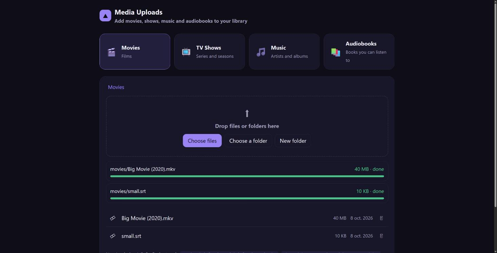

A simple drag-and-drop page with progress bars, folders and resumable uploads, on its own HTTPS hostname with its own login. See [Upload page](docs/11-upload-page.md). Prefer the terminal? `rsync -avP --partial` works too.

## Direct Play: the one idea that matters

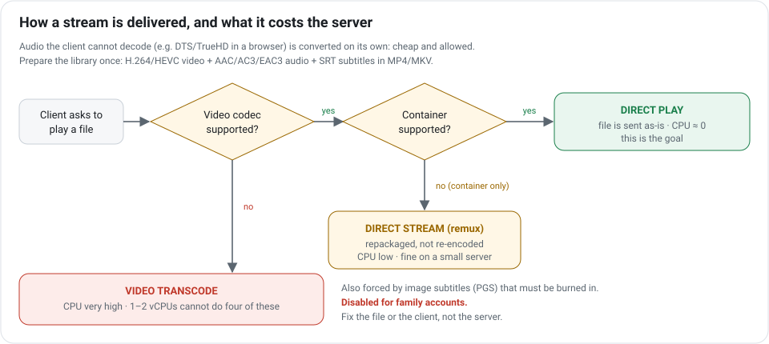

A 1–2 vCPU VPS **cannot transcode video for four people**. So the design is: make files that clients can play as-is, and **turn video
transcoding off** for family accounts. When something does not play, fix the *file* (or the client app) once, not the server.

| Client | Safe choice | Usually causes trouble |
|---|---|---|
| **LG webOS TV** | H.264 / HEVC video, AAC / AC3 / EAC3 audio, MP4 or MKV, **SRT** subtitles | DTS or TrueHD as the only audio; PGS (image) subtitles |
| **Chrome / Edge** | H.264 + AAC | AC3 / EAC3 / DTS audio (audio-only transcode: cheap), HEVC without hardware support |
| **Android / iPhone app** | H.264 / HEVC + AAC | Some MKV audio/subtitle combinations; PGS subtitles |

Convert only the audio, leaving the video untouched (on **your** computer, not the server):

```bash
ffmpeg -i input.mkv -map 0 -c copy -c:a eac3 -b:a 640k output.mkv
```

More in [Configure Jellyfin](docs/06-configure-jellyfin.md).

## Security model

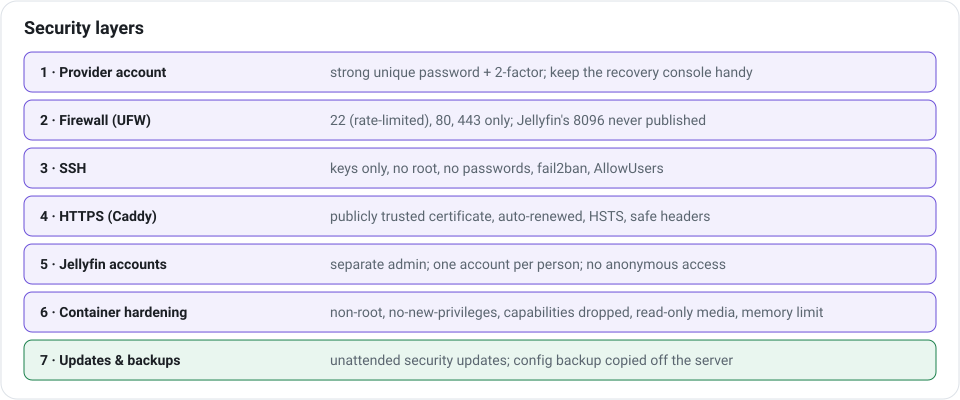

**Exposed ports**

| Port | Service | Who can reach it |
|---|---|---|
| 22/tcp | SSH | Anyone, but only with your key (rate-limited, fail2ban, `AllowUsers`) |
| 80/tcp | Caddy | Certificate challenge and redirect to HTTPS |
| 443/tcp+udp | Caddy → Jellyfin | Your family, with their own accounts |
| 8096 | Jellyfin | **Nobody** from outside (private Docker network only) |

**Things the guide deliberately does**

- The first-run wizard runs through an SSH tunnel **before** the server is public, so nobody can claim the admin account.
- The admin account is separate from viewing accounts; viewers have no admin rights and no video transcoding.
- Media is mounted **read-only** into the container; the container runs as a normal user with no extra privileges.
- Docker-published ports bypass UFW, so the stack publishes **only** what it means to (80/443).
- `scripts/04-mount-media.sh` never formats a disk unless you pass `--format` **and** type the device name back.

Found a security problem in these scripts or configs? Open an issue describing the affected file and impact, **without** publishing exploit details or any secrets.

## Storage layout

| Path | Disk | Contents | Backup? |
|---|---|---|---|
| `/opt/jellyfin/config` | System SSD/NVMe | Jellyfin database, users, watch state | **Yes**, copy off the server |
| `/opt/jellyfin/cache` | System SSD/NVMe | Image cache | No, rebuilt automatically |
| `/opt/jellyfin/backups` | System disk | Config archives (last 7) | Pull to your own computer |
| `/srv/media/{movies,shows,music,audiobooks}` | Data disk | Your media (read-only in the container) | Keep originals elsewhere |
| `caddy_data` Docker volume | System disk | TLS certificates | No, re-issued automatically |

> **The provider's big disk is not a backup.** Treat the VPS as disposable: keep your originals, and keep an off-server copy of the config.

## Repository layout

```
selfhost-jellyfin/
├── README.md
├── wizard/
│   └── index.html            # offline step-by-step wizard (open in a browser)
├── deploy/
│   ├── compose.yaml          # Jellyfin + Caddy
│   ├── compose.setup.yaml    # temporary override for the private first-run wizard
│   ├── uploads/              # optional upload page (compose override, Caddy site, front-end)
│   ├── Caddyfile             # HTTPS reverse proxy
│   └── .env.example          # versions, hostname, user ids
├── scripts/
│   ├── 01-bootstrap.sh       # admin user, SSH key, firewall, updates, fail2ban
│   ├── 02-lock-ssh.sh        # disable root + password logins (after you tested the key)
│   ├── 03-install-docker.sh  # Docker Engine + Compose from the official repo
│   ├── 04-mount-media.sh     # safe data-disk mounting
│   ├── 05-setup-uploads.sh   # optional drag-and-drop upload page
│   ├── backup.sh             # config + database backup, keeps newest 7
│   ├── disk-alert.sh         # warns when a filesystem is nearly full
│   ├── verify.sh             # post-install health and exposure checks
│   └── stream-test.sh        # bounded multi-stream throughput test
└── docs/                     # step-by-step guides + illustrations (docs/img)
```

## Scripts

| Script | Run as | Changes | Safe to re-run? |
|---|---|---|---|
| `01-bootstrap.sh` | root | Creates admin user and key, enables UFW, fail2ban, auto-updates | Yes |
| `02-lock-ssh.sh` | root | Writes `/etc/ssh/sshd_config.d/00-hardening.conf`, reloads SSH | Yes |
| `03-install-docker.sh` | root | Adds Docker repo, installs Docker, log rotation | Yes |
| `04-mount-media.sh` | root | Mounts a disk at `/srv/media`, adds an `fstab` entry | Yes (never formats without `--format`) |
| `07-enable-autoscan.sh` | root | Installs a service that asks Jellyfin to scan the affected library about a minute after media changes (one scan per upload batch) and copies `Subs/` subtitle files next to their videos (fixes uploads into empty libraries not appearing) | Yes |
| `05-setup-uploads.sh` | root | Optional: starts the upload page container, adds its HTTPS site and one login | Yes (keeps the existing login) |
| `backup.sh` | root | Stops Jellyfin briefly, writes a tarball, prunes old ones | Yes |
| `disk-alert.sh` | root | Logs (and optionally pushes) when a disk is ≥ 85 % full | Yes |
| `verify.sh` | root | Read-only checks | Yes |
| `stream-test.sh` | anyone | Read-only download test against your server | Yes |

Read a script before running it. Each one starts with a comment explaining what it does.

## Day-2 operations cheat sheet

```bash
cd /opt/jellyfin
sudo docker compose ps                         # status and health
sudo docker compose logs --tail 100 jellyfin   # recent logs
sudo docker compose restart jellyfin           # restart
sudo /opt/jellyfin/scripts/backup.sh           # backup now
sudo bash /opt/jellyfin/scripts/verify.sh media.example.com

# update Jellyfin: backup, change JELLYFIN_VERSION in .env, then
sudo docker compose pull && sudo docker compose up -d
```

| When | Do |
|---|---|
| Weekly | Backup runs; glance at `docker compose ps` and `df -h` |
| Monthly | `apt update && apt list --upgradable`; reboot if `/var/run/reboot-required` exists; check Jellyfin releases |
| Before renewal | Decide to keep, change or cancel. **Copy off config and any unique media first**, then cancel in the provider's panel |

## FAQ

**Do I need a domain?** You need a *hostname* with a valid public certificate. A domain you own works; so does a free dynamic-DNS name. TV apps usually
reject self-signed certificates and bare IP addresses.

**Can I use hardware transcoding?** Plain VPSes have no GPU. Design for Direct Play. If you need transcoding, rent a machine with a GPU, which is a different cost class.

**Why Caddy and not Nginx?** Automatic HTTPS in three lines of config and safe defaults. Any reverse proxy works if you keep 8096 private.

**Why is Jellyfin run as my admin user's ID?** So the account you upload media with can also be read by Jellyfin without permission juggling. Media is read-only inside the container.

**Can family members upload?** By design no. They watch; the admin uploads (`rsync`/SFTP). Keep it that way unless you add proper accounts and quotas.

**What about audiobooks?** Jellyfin has no first-class audiobook library; most people use a Music library (one folder per author, one subfolder per book) or the Books type. Test one title on every client first.

**Is the written guide the same as the wizard?** The wizard renders the same steps with your values filled in. If they ever disagree, the scripts and `docs/` are the source of truth. Please open an issue.

## Honest limitations

- A small VPS **cannot** transcode four video streams. Compatible files are part of the design, not an optional tweak.
- Cheap large-disk plans are often write-cached or shared HDD arrays: fine for sequential video, weak for random I/O. Keep the database on the system disk and keep backups elsewhere.
- Remote viewers are limited by **their** internet line and your port/traffic allowance, not only by the server.
- Provider terms vary. "Personal media streaming" is rarely named explicitly. Ask in writing if in doubt.
- LG webOS app availability and codec support depend on TV model and firmware. Test on the real TV.
- This is a hobby-scale setup: no high availability. Plan for the VPS to disappear and be able to rebuild in an evening.

## Project status

- The Compose files, Caddyfile, scripts and wizard are written and syntax-checked; the wizard has been exercised in a browser.
- The full flow is being validated end to end on a real server; fixes will be committed here as they come up. If something fails for you, please open an issue with the step number and output.

## Contributing and license

Issues and pull requests are welcome: corrections, extra client notes, translations (French and Arabic would be very useful for the family audience). Keep the guide **provider-neutral**: describe what to verify, not who to buy from.

Licensed under the [MIT License](LICENSE). Jellyfin, Docker, Caddy, Ubuntu and LG are trademarks of their respective owners; this project is not affiliated with them.
