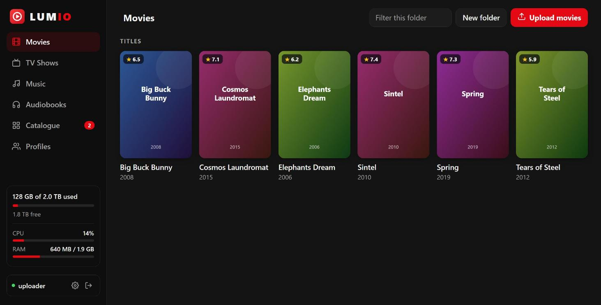
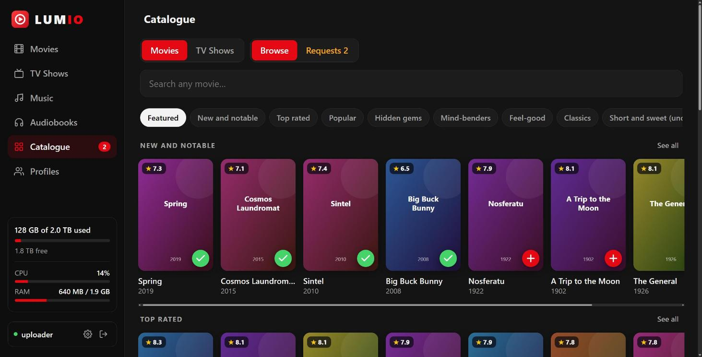
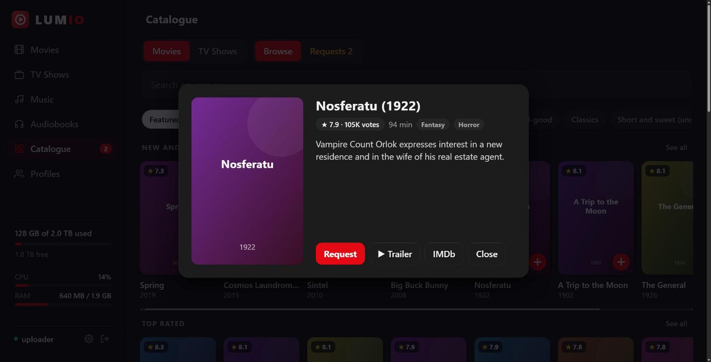
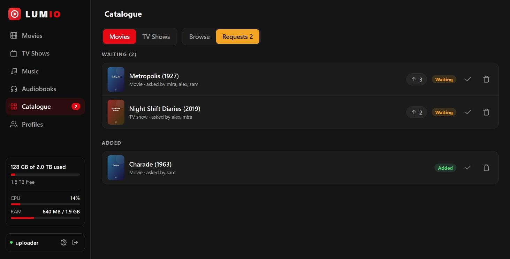
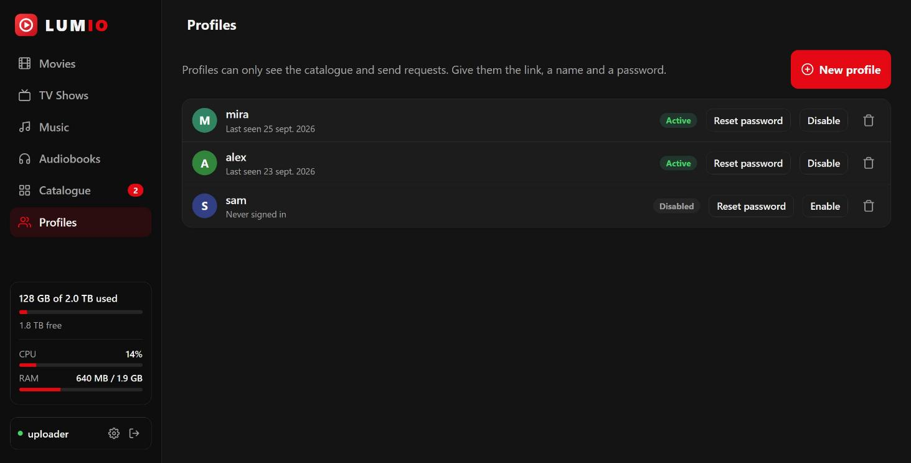
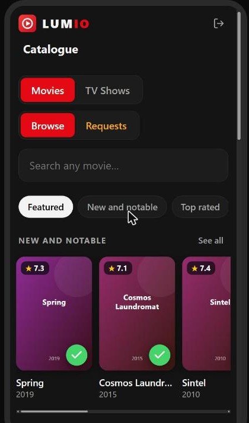

# 11. Upload page, catalogue and guest profiles (optional)

One small web app on its own hostname (for example `files.example.com`) with a single branded sign-in. It gives you:

- **For you (admin):** drag-and-drop uploads straight into the library folders, folder sizes, posters from Jellyfin, server CPU/RAM/disk, guest profiles and the request list.
- **For the people you share it with (guest profiles):** only the **Catalogue**: browse what could be added and ask for it. Nothing else.

| | |
|---|---|
|  |  |
| Your library, with posters and sizes. The upload button names the tab you are on ("Upload movies"). | The catalogue: shelves, categories, ratings. Tap **+** to request. |
|  |  |
| Details, a trailer link and one-tap request. | Requests, most-wanted first. Asking again adds your vote. |
|  |  |
| Guest profiles you create and control. | Works on a phone. A guest sees only this. |

(Screenshots use sample titles that are open-licensed or in the public domain.)

## What it is
- [Dufs](https://github.com/sigoden/dufs), a small maintained file server, for the files. It has **no login of its own** and is reachable only through Caddy, after sign-in.
- `uploads-meta`, a ~600-line Python service (standard library only) that does sign-in, roles, posters and metadata from Jellyfin, folder sizes, the catalogue and the request list. Its files are in `deploy/uploads/meta/`.
- One front-end page, `deploy/uploads/assets/index.html`. The same page is served to both roles; guests get a version that only contains the catalogue.
- Jellyfin keeps its **read-only** view of `/srv/media`. Only the upload container can write there.

## Set it up
1. Give it its own hostname pointing at the server, for example `files.example.com` (same IP as Jellyfin).
2. In Jellyfin: **Dashboard > API Keys > +** and create a key (any name). The script uses it once to create a separate key for the helper service.
3. On the server:
   ```bash
   cd ~/selfhost-jellyfin
   sudo JELLYFIN_API_KEY=<the key> bash scripts/05-setup-uploads.sh files.example.com
   ```
   The script prints the admin password **once** (name: `uploader`). Store it in a password manager. If the old Basic-auth login was set up before, its password is kept.
4. Open `https://files.example.com`, sign in, and drop files. Change the password under **Settings** (gear icon, bottom left).

## Guest profiles
- **Profiles > New profile**: type a name, get a readable password (`proud-panda-quick-52`) and a ready-to-send message with the link. The password is shown only once; **Reset password** makes a new one.
- Guests see the catalogue and their own requests. They cannot upload, delete, see your folders, sizes or server stats, or mark requests as added. This is enforced on the server for every call, not just hidden in the page.
- **Disable** or **Delete** signs the person out immediately.
- **Settings > Add admin** creates a second admin. You can change your own password there. The main admin cannot be deleted and the last admin cannot be disabled.

## The catalogue and requests
- Shelves such as *Top rated*, *Popular*, *Hidden gems*, *Mind-benders*, *Feel-good*, *Short and sweet* and genre rows come from IMDb's free daily rating files (rebuilt weekly in the background). Posters and plots come from Jellyfin's own TMDb lookup and are cached on the server so pages load fast.
- Each shelf shows its best 16 titles; **See all** (or a category chip) opens up to 300 titles that keep loading as you scroll, with **Sort by** Rating, Popularity, Newest or A to Z.
- Tap a poster for details (rating, runtime, genres, plot), a **Trailer** link (a YouTube search for the title) and an **IMDb** link. **+** requests it.
- A title already in your library shows a green tick. Asking for something already requested adds your vote; the list is sorted by votes.
- The request list is a small SQLite file in `/opt/jellyfin/uploads/data/`. Back it up with the rest of `/opt/jellyfin`.

## Uploading
- **Upload** opens a small dialog with a drop box ("Upload movies", "Upload TV shows", ...). Inside a title folder the video is listed first, folders like `Subs` become compact chips and the many subtitle files are tucked into a collapsed "Subtitles and extras" section.
- **Rename** (pencil icon) works on titles, folders and files. The dialog suggests a clean `Title (Year)` name.
- **Tidy up** (button on a title folder) renames the folder and video to `Title (Year)`, renames matching subtitle files with it, puts episodes into `Season NN` folders, and can remove promo files from release sites. You see the full list first; nothing changes until you press Apply.
- Titles Jellyfin could not match are marked **Not matched**; the page shows the right poster anyway (guessed from the name) and Tidy up fixes the name so Jellyfin finds it too.
- Files are sent in 16 MB pieces to `name.uploading` and renamed when complete. A file already on the server with the same size is skipped; a partial one continues from where it stopped.
- **Connection lost** (Wi-Fi drop, VPN switch): the page waits for the network and carries on by itself.
- **Refresh, closed tab or crash:** when you choose or drop a **folder** in Chrome, Edge or another Chromium browser, the page remembers it. After a reload a banner offers **Resume**; one click and only what is missing is sent. In other browsers, add the same folder again: finished files are skipped.
- The browser itself shows a native question when you pick a folder ("Upload 110 files to this site?" or "Let site view files?"). That is a browser security prompt and cannot be removed by a web page. **Dragging** the folder onto the page avoids the first one.
- "Done" means the file is **stored**. Jellyfin adds it to the library about a minute later **if the auto-scan service is installed** (`sudo JELLYFIN_API_KEY=<key> bash scripts/07-enable-autoscan.sh`).
- **Refresh Jellyfin** (button in the top bar of a library) asks Jellyfin to scan right now, instead of waiting for the automatic scan.
- Use clean names (`Movie Title (2020)/Movie Title (2020).mkv`), see [Add media](08-first-media-and-testing.md).

## Security notes
- Sign-in is a random session token in an `HttpOnly; Secure; SameSite=Strict` cookie. Only a hash of the token is stored. Passwords are PBKDF2-SHA256 hashed; the first admin password keeps its original SHA-512 hash.
- Failed sign-ins are throttled per address and per account.
- Writes need a JSON body and a same-site origin, so another website cannot trigger them with your saved session.
- The helper holds a Jellyfin API key. Jellyfin keys are admin-level, so the service only makes a fixed set of read-only calls and is reachable only through Caddy.
- Caddy sets a strict Content-Security-Policy, `X-Frame-Options: DENY` and compresses text responses.
- Prefer the command line? `rsync -avP --partial ./movies/ media@SERVER:/srv/media/movies/` works too.
- Why not File Browser? It was a popular choice but the project is archived with no further security fixes, so this guide does not use it.

If you edit `deploy/uploads/assets/index.html`, copy it to `/opt/jellyfin/uploads/assets/` and run `sudo docker compose restart uploads`: the file server keeps the page in memory. If you edit the Python files, restart `uploads-meta`.

## Deleting titles (do it here, not in Jellyfin)
- Delete files with the 🗑 button **on this page**. Jellyfin only has a read-only view of the media folder, so its own "Delete media" command cannot remove files.
- About a minute after the last change the auto-scan service refreshes the library and also removes the entries whose files are gone. This includes the case where you delete the **last** title of a library, which Jellyfin alone would never clean up.
- A browser tab that was already open can show the old row for up to three minutes; reload the page.
